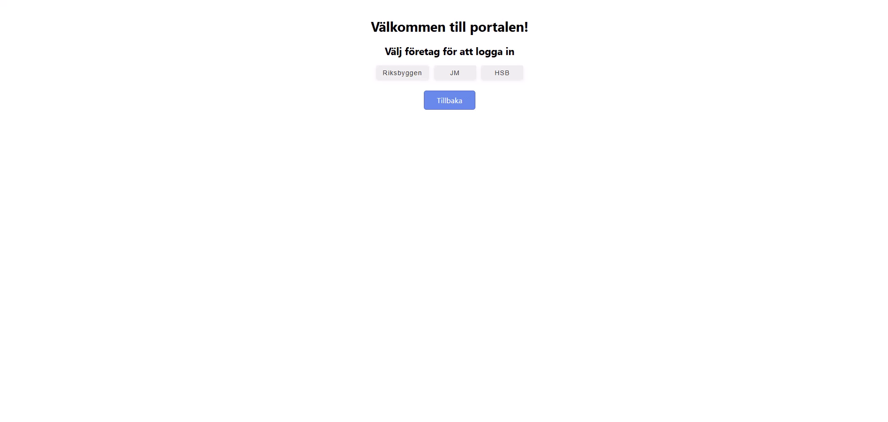

# Real Estate Client

## Getting Started

### Prerequisites
- Node.js (v18 eller senare rekommenderas)
- npm (medföljer Node.js)

### Installation
1. Klona projektet eller ladda ner källkoden.
2. Öppna en terminal i projektmappen.
3. Installera beroenden:
	```bash
	npm install
	```

### Konfiguration
1. Skapa eller redigera `.env`-filen i projektroten:
	```env
	REACT_APP_AUTHORIZATION_TOKEN=YOUR_TOKEN_HERE
	REACT_APP_COMPANIES_URL=https://localhost:7068/companies
	```
  > **Viktigt:** Lägg aldrig till din `.env`-fil i versionshantering (git). Använd CI/CD-miljövariabler för produktion och håll dina tokens säkra.
  > Byt ut `REACT_APP_AUTHORIZATION_TOKEN` mot produktionsvärdet vid deploy.

2. Se till att backend-API är igång och tillgängligt på de angivna URL:erna.

### Starta applikationen
Kör följande kommando i terminalen:
```bash
npm start
```
Applikationen startar på `http://localhost:3000`.

## Projektstruktur
- `src/components/` – Återanvändbara React-komponenter
- `src/services/` – API-anrop och logik
- `src/types/` – Typdefinitioner
- `src/constants/` – Statiska texter och konstanter

## Felsökning
- Kontrollera att backend-API är igång och tillåter CORS.
- Kontrollera att URL:erna i `.env` är korrekta.
- Se terminalen för eventuella felmeddelanden.

### CORS och proxy vid lokal utveckling

Om API:et inte tillåter CORS för localhost kan du:

1. **Aktivera CORS på backend**
	- Lägg till localhost som tillåten origin i backendens CORS-middleware .
2. **Använd frontend-proxy**
	- För Create React App: lägg till `"proxy": "http://localhost:7055"` i `package.json`.
> **Obs!** Proxy-inställningar är endast för lokal utveckling. Ta bort eller justera dem för produktion.

## Exempel: Azure Static Web Apps workflow (INTE aktivt i detta repo)

> **Obs!** Detta är **endast ett exempel** på hur en GitHub Actions-workflow för **Azure Static Web Apps** kan se ut.  
> Den är inte kopplad till detta projekt och kommer **inte** att bygga eller deploya någonting här.

Syftet är att visa struktur och fält i YAML-filen så att du kan använda den som referens i andra projekt.


## Learn More

Du kan läsa mer i [Create React App-dokumentationen](https://create-react-app.dev/docs/getting-started).

För att lära dig React, besök [React-dokumentationen](https://react.dev/).
